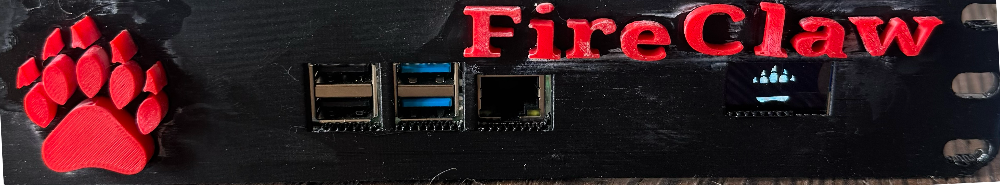
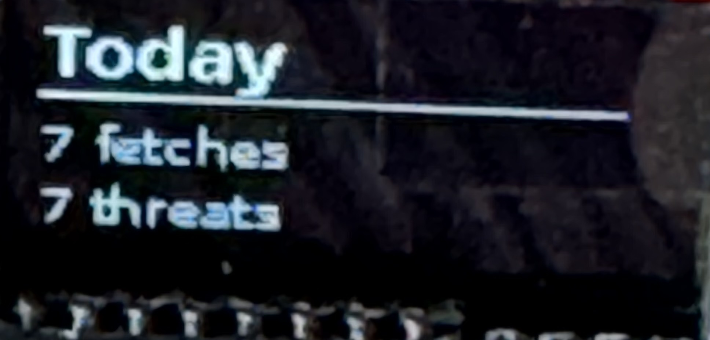

# 🛡️ FireClaw — A Firewall for Your Agent's Brain

<p align="center">
  
</p>

<p align="center">
  <strong>Open-source security proxy that protects AI agents from prompt injection attacks.</strong>
</p>

<p align="center">
  <a href="https://fireclaw.app">Website</a> •
  <a href="#quick-start">Quick Start</a> •
  <a href="#how-it-works">How It Works</a> •
  <a href="#community-threat-feed">Community Threat Feed</a> •
  <a href="#want-to-help">Want to Help?</a>
</p>

---

## The Problem

AI agents that browse the web are vulnerable to **prompt injection attacks**. Malicious websites can embed hidden instructions that hijack your agent's behavior — stealing data, executing commands, or overriding safety guidelines. Simple input filtering isn't enough; this is an adversarial problem that requires defense-in-depth.

**No existing open-source tool addresses this.** FireClaw fills that gap.

## What FireClaw Does

FireClaw sits between your AI agent and the internet. Every web fetch passes through a **hardened 4-stage pipeline** that strips prompt injection payloads before content reaches your agent's context window.

Your agent calls FireClaw instead of fetching directly. FireClaw returns clean, factual content — no hidden instructions, no Unicode tricks, no encoding exploits.

---

## How It Works

```
  Your Agent                    FireClaw                     The Web
      │                            │                            │
      │── fetch("example.com") ──▶│                            │
      │                            │── GET example.com ────────▶│
      │                            │◀── raw HTML ──────────────│
      │                            │                            │
      │                            │  ┌─── Stage 1: DNS Check ─────┐
      │                            │  │ Block known-malicious URLs  │
      │                            │  └────────────────────────────┘
      │                            │            ↓
      │                            │  ┌─── Stage 2: Sanitize ──────┐
      │                            │  │ Strip HTML tricks, hidden   │
      │                            │  │ Unicode, encoding exploits, │
      │                            │  │ inject canary tokens        │
      │                            │  └────────────────────────────┘
      │                            │            ↓
      │                            │  ┌─── Stage 3: LLM Summary ───┐
      │                            │  │ Isolated LLM extracts facts │
      │                            │  │ only — no tools, no memory  │
      │                            │  └────────────────────────────┘
      │                            │            ↓
      │                            │  ┌─── Stage 4: Output Scan ───┐
      │                            │  │ Check for residual inject-  │
      │                            │  │ ions, canary survival,      │
      │                            │  │ tool-call syntax            │
      │                            │  └────────────────────────────┘
      │                            │
      │◀── clean content ─────────│
```

### The Key Insight

Even if the summarization LLM in Stage 3 gets injected, **it has no tools, no memory, and no access to your data.** It can only return text. And that text still passes through Stage 4 output scanning. The attacker is in a dead end.

---

## Features

- **200+ Injection Patterns** — Regex-based detection covering structural tricks, injection signatures, exfiltration attempts, and output manipulation
- **DNS-Level Blocklists** — Integrates URLhaus, PhishTank, OpenPhish, and the FireClaw community blocklist
- **Canary Token System** — Unique markers injected into content detect if summarization was bypassed
- **Domain Trust Tiers** — Configure trusted (skip sanitization), neutral (full pipeline), suspicious (aggressive), or blocked (reject) per domain
- **Rate Limiting & Cost Controls** — Per-minute/hour/day limits with auto-throttle and hard caps
- **JSONL Audit Logging** — Complete forensic trail of every fetch, detection, and alert
- **No Bypass Mode** — The pipeline is fixed. Even if your agent is compromised, it cannot disable FireClaw.
- **OLED Display Support** — Optional Raspberry Pi OLED integration for physical monitoring
- **Dashboard** — Web-based UI for monitoring, configuration, and log browsing

---

## Community Threat Feed

**FireClaw gets smarter when we work together.**

When you enable data sharing (opt-in), FireClaw anonymously contributes detection metadata to a shared community threat feed. No page content is ever sent — only:

- Domain name
- Number of detections and severity level
- Domain trust tier
- Whether the fetch was flagged
- Processing duration

This data helps the entire FireClaw community by:
- **Identifying emerging threat domains** across all instances
- **Improving pattern detection** through real-world signal
- **Building a shared blocklist** that benefits everyone
- **Tracking injection trends** over time

### How to Enable

In your `data/settings.json`, just flip one switch:

```json
{
  "privacy": {
    "shareData": true
  }
}
```

That's it. No API keys to configure — FireClaw ships with the community endpoint built in. All instances write to the same shared threat database, protected by Row Level Security (INSERT-only — no one can read, modify, or delete other instances' data through the public API).

**Privacy first:** Data sharing is disabled by default. You choose whether to participate. All data is anonymized with a random instance ID — no personal information, no IP addresses, no page content.

### Input Validation

All community data submissions are validated and sanitized before being sent:
- Whitelisted fields only (no extra data can sneak in)
- Type checking and range limits on every field
- Supabase URL validated against expected domain patterns (SSRF protection)
- Instance IDs validated as UUID v4 format
- 5-second timeout on all submissions
- Non-blocking — submission failures never affect proxy operation

---

## Quick Start

### Prerequisites

- Node.js 18+
- npm

### Install

```bash
git clone https://github.com/raiph-ai/fireclaw.git
cd fireclaw
npm install
```

### Configure

Copy the default settings:

```bash
cp data/settings.example.json data/settings.json
```

Edit `config.yaml` for your environment:

```yaml
fireclaw:
  enabled: true
  model: "anthropic/claude-haiku-4"  # LLM for Stage 3
  
  trust_tiers:
    trusted:
      - "wikipedia.org"
      - "github.com"
  
  alerts:
    enabled: true
    channel: "slack:YOUR_CHANNEL_ID"
    threshold: "medium"
```

### Run

```bash
node dashboard/server.mjs
```

The dashboard and proxy API will be available at `http://localhost:8420`.

### Test

```bash
curl -X POST http://localhost:8420/api/proxy \
  -H 'Content-Type: application/json' \
  -H 'X-FireClaw-Action: fetch' \
  -d '{"url":"https://example.com","intent":"Get page summary"}'
```

---

## API

### `POST /api/proxy`

Fetch a URL through the FireClaw pipeline.

**Headers:**
- `Content-Type: application/json`
- `X-FireClaw-Action: fetch`

**Body:**
```json
{
  "url": "https://example.com",
  "intent": "What is this page about?"
}
```

**Response:**
```json
{
  "content": "Sanitized summary of the page...",
  "error": null,
  "metadata": {
    "fetchId": "a1b2c3d4",
    "tier": "neutral",
    "detections": 2,
    "severity": 6,
    "severityLevel": "medium",
    "flagged": false,
    "duration": 1234,
    "canaries": 3,
    "skippedSanitization": false
  }
}
```

### `GET /api/health`

Health check endpoint.

### `GET /api/stats`

Runtime statistics (detections, blocks, rate limits, cache).

---

## Architecture

### Core Components

| File | Purpose |
|------|---------|
| `fireclaw.mjs` | Main pipeline orchestrator |
| `sanitizer.mjs` | Pattern matching, sanitization, canary system |
| `patterns.json` | 200+ regex patterns for injection detection |
| `config.yaml` | Full configuration |
| `proxy-prompt.md` | Hardened system prompt for Stage 3 |

### Modules

- **ResultCache** — In-memory caching with configurable TTL
- **RateLimiter** — Token bucket rate limiting (per minute/hour/day)
- **DNSBlocklistManager** — Threat feed fetching and domain blocking
- **DomainTrustManager** — Per-domain sanitization intensity
- **AuditLogger** — Append-only JSONL with replay support
- **AlertManager** — Severity-tiered alerts with digest mode
- **CanaryTokenSystem** — Inject and detect bypass markers

### Inner Alignment Protection

FireClaw has **no bypass mode**. The pipeline is fixed and cannot be disabled at runtime:

```yaml
inner_alignment:
  allow_override: false    # Cannot be changed
  allow_bypass: false      # Cannot be changed
  log_override_attempts: true
```

If your agent is compromised, the attacker cannot disable FireClaw. Period.

---

## Hardware Appliance (Optional)

FireClaw can run as a dedicated physical appliance on a **Raspberry Pi** with a 3D-printed enclosure and OLED display.

<p align="center">
  
</p>

The 128×64 OLED display (SSD1306, I2C) rotates through five screens every 5 seconds:

| Screen | What It Shows |
|--------|---------------|
| **Claw** | Animated FireClaw logo — ignites with flames and sparks when a threat is detected, with `!! THREAT !!` banner |
| **IP/Network** | Device hostname and IP address |
| **Today's Stats** | Live fetch count and threat detections for the current day |
| **Uptime** | How long the proxy has been running (days/hours/minutes) with a heartbeat indicator |
| **Health** | CPU temperature, RAM usage, and disk usage |

<p align="center">
  
  <br>
  <em>OLED showing daily fetch and threat counts</em>
</p>

When a threat is detected, the display interrupts its rotation to show the claw icon engulfed in animated flames for 5 seconds — a visual confirmation that FireClaw caught something.

See the `oled/` directory for the display service, claw bitmap, and wiring details.

---

## Threat Model

### Protects Against

✅ Embedded instructions in web content  
✅ Unicode tricks (RTL overrides, zero-width chars, homoglyphs)  
✅ HTML obfuscation (hidden CSS, comments, data URIs)  
✅ Encoding exploits (base64 blobs, URL encoding, hex escapes)  
✅ Jailbreak attempts ("ignore previous instructions", "you are now", "DAN mode")  
✅ Tool call injection (function syntax, escaped quotes in output)  
✅ Data exfiltration (webhooks, suspicious URLs, email addresses)  
✅ Summarization bypass (canary token detection)  

### Does Not Protect Against

❌ Image-based injection (text in images) — planned  
❌ PDF-embedded exploits — planned  
❌ Audio/video injection — out of scope  
❌ Zero-day LLM vulnerabilities — requires model-level fixes  
❌ Social engineering — requires human judgment  

---

## Roadmap

- [ ] Image content analysis (OCR + vision model)
- [ ] PDF sanitization pipeline
- [ ] Machine learning pattern detection
- [ ] Federated learning from community data
- [ ] Real-time pattern updates from threat feed
- [ ] Multi-framework integration guides

---

## Want to Help?

FireClaw is a community project and we'd love your contribution. Whether you're a security researcher, an AI engineer, or someone who cares about making AI agents safer — there's a place for you.

### Ways to Contribute

- **🔍 Share injection patterns** — Found a new attack vector? Help us detect it.
- **🧪 Test and break things** — Try to bypass the pipeline and report what you find.
- **📝 Improve documentation** — Make FireClaw easier to understand and adopt.
- **🔧 Build integrations** — Connect FireClaw to other AI agent frameworks.
- **📊 Enable data sharing** — Every instance that contributes detection data makes the community threat feed stronger.

### Get in Touch

- **GitHub Issues** — Bug reports, feature requests, pattern contributions
- **Email** — [security@fireclaw.app](mailto:security@fireclaw.app) for responsible disclosure
- **Website** — [fireclaw.app](https://fireclaw.app)

If you're interested in contributing or have questions, please open an issue or reach out. We're building this together.

---

## License

FireClaw is licensed under the **GNU Affero General Public License v3.0 (AGPLv3)**.

See [LICENSE](LICENSE) for the full text.

The community threat feed data is shared under separate [dataset terms](DATASET_TERMS.md).

"FireClaw" is a trademark of Ralph Perez. See [TRADEMARK.md](TRADEMARK.md) for usage guidelines.

---

## Security

Found a bypass or vulnerability? Please report responsibly:

- **Email:** [security@fireclaw.app](mailto:security@fireclaw.app)
- **Policy:** 90-day coordinated disclosure

---

<p align="center">
  <strong>FireClaw — Defend Your Agent. Protect Your Data. Join the Community.</strong>
</p>

<p align="center">
  🛡️ <a href="https://fireclaw.app">fireclaw.app</a>
</p>
